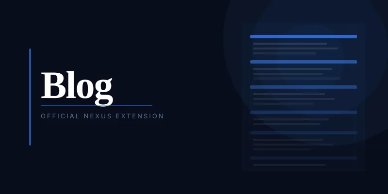

# Blog

A full-featured community blog for [Nexus](https://nexusprism.org). Supports categories with colour and icon customisation, hero images, rich Markdown articles, a draft/publish workflow, right sidebar widgets, and digest integration.

## Installation

Install via **Admin → Extensions → Install from URL** using the manifest URL, or from the registry in the Nexus admin panel.

## Features

- **Full-bleed hero images** — article cards and the reading view use the hero image as a full-width background with a gradient overlay
- **Categories** — admin-defined categories with a custom colour (full colour picker with presets) and Font Awesome icon
- **Rich composer** — hero image upload, title field, category selector, full Markdown toolbar with inline image uploads, and draft/publish workflow
- **Blog index** — featured hero card for the latest article, two-column grid for the rest, category filter pills
- **Article reading view** — full hero, title, author, date, reading time, and rendered Markdown body
- **Right sidebar widgets** — "From the blog" on the feed showing the two latest articles; "Recent articles" and "Categories" on blog pages
- **Digest integration** — "Latest from the blog" section in digest emails

## Usage

Once installed, **Blog** appears in the left sidebar Explore section. Click it to browse published articles.

Admins manage the blog via **Admin → Blog**:

- **Articles tab** — view all articles (published and draft), publish/unpublish, edit, delete
- **Categories tab** — create and manage categories with colour and icon

### Writing articles

Click **+ Write article** from the blog index or Admin → Blog → Articles. The composer supports:

- A full-width hero image upload
- H1 / H2 / H3 headings, bold, italic, strikethrough, links, code blocks, blockquotes, dividers, and lists
- Inline image uploads via the toolbar image button
- Save as draft or publish immediately

## Permissions

| Permission | Default | Controls |
|---|---|---|
| `can_view_blog` | everyone | Blog index and article reading |
| `can_write_articles` | admin | Open composer, save drafts |
| `can_publish_articles` | admin | Publish and unpublish articles |

Configure in **Admin → Permissions → Blog**.

## Settings

| Setting | Default | Description |
|---|---|---|
| Blog title | Blog | Page heading displayed on the blog index |
